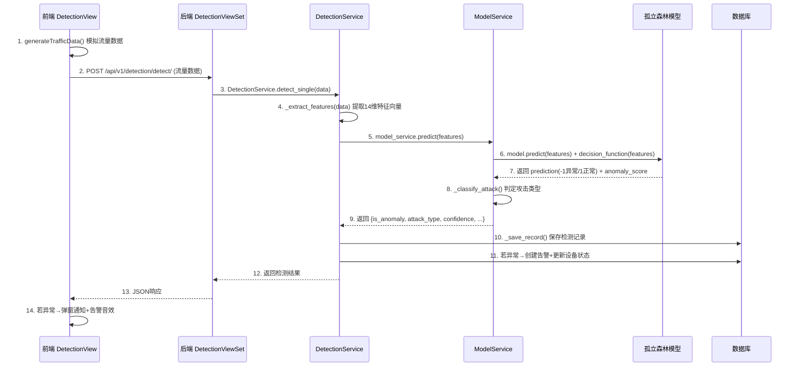

# 异常检测流程详解

## 一、流程总览

整个异常检测的过程可以概括为 **"前端模拟数据 → 后端特征提取 → 模型推理判定 → 结果存储告警"** 四个阶段。

### 核心时序图



---

## 二、第1阶段：前端生成模拟流量数据

**文件位置**：`frontend/src/views/DetectionView.vue`

在 `DetectionView` 页面中，`generateTrafficData` 函数为每台在线设备生成一条 **模拟的网络流量数据**：

```javascript
const generateTrafficData = (device) => {
  return {
    device_id: device.device_id,
    src_ip: device.ip_address || '192.168.1.100',   // 设备源IP
    dst_ip: '192.168.1.1',                           // 网关目的IP
    src_port: Math.floor(Math.random() * 60000) + 1024,  // 随机源端口
    dst_port: [80, 443, 8080, 22, 3306][...],             // 随机目的端口
    protocol: ['tcp', 'udp'][...],                         // 随机协议
    duration: Math.random() * 10,                          // 连接持续时间(秒)
    orig_bytes: Math.floor(Math.random() * 50000),         // 发送字节数
    resp_bytes: Math.floor(Math.random() * 100000),        // 接收字节数
    orig_pkts: Math.floor(Math.random() * 100),            // 发送包数
    resp_pkts: Math.floor(Math.random() * 150)             // 接收包数
  }
}
```

> **本质**：模拟一次设备与网关之间的网络通信记录，包含源/目的IP、端口、协议、流量大小、包数等网络流量指标。在实际部署中，这些数据会来自 ESP32 设备或 Wireshark 抓包。

### 检测触发方式

前端提供了两种检测触发方式：

| 方式 | 函数 | 说明 |
|------|------|------|
| 单次检测 | `startDetection()` | 手动点击按钮，对所有在线设备（或已选设备）执行一轮检测 |
| 连续监控 | `startContinuousDetection()` | 通过 `setInterval` 定时器，每隔指定间隔（默认5秒）自动执行一轮检测 |

每轮检测的核心逻辑在 `runDetectionRound()` 中：

```javascript
const runDetectionRound = async () => {
  // 1. 筛选目标设备（已选设备或全部在线设备）
  const targetDevices = selectedDevices.value.length > 0 
    ? devices.value.filter(d => selectedDevices.value.includes(d.device_id) && d.status === 'online')
    : devices.value.filter(d => d.status === 'online')

  // 2. 逐台设备生成流量数据并调用后端接口
  for (const device of targetDevices) {
    const trafficData = generateTrafficData(device)
    const res = await detectSingle(trafficData)     // POST /api/v1/detection/detect/
    const result = res.data.data || res.data
    
    if (result.is_anomaly) {
      sendAlertNotification(device, result.attack_type, result.confidence)
    }
  }
}
```

---

## 三、第2阶段：后端特征工程（关键步骤）

**文件位置**：`backend/detection/services/detection_service.py`

### 3.1 入口方法 `detect_single`

数据到达后端后，`DetectionService.detect_single(data)` 方法负责整个检测流程的编排：

```python
@staticmethod
def detect_single(data: Dict[str, Any]) -> Dict[str, Any]:
    # 1. 提取特征
    features = DetectionService._extract_features(data)
    
    # 2. 模型预测
    result = model_service.predict(features)
    
    # 3. 保存检测记录到数据库
    record = DetectionService._save_record(data, result)
    
    # 4. 更新设备统计信息
    DeviceService.update_device_stats(device_id, result['is_anomaly'])
    
    # 5. 若检测到异常 → 更新设备状态为warning + 创建告警记录
    if result['is_anomaly']:
        DeviceService.update_device_status(device_id, 'warning')
        AlertService.create_alert_from_detection(record, result)
    
    return {'record_id': record.id, **result}
```

### 3.2 特征提取 `_extract_features`

`_extract_features` 方法将原始数据转化为 **14维特征向量**，与模型训练时保持一致：

```python
FEATURE_COLUMNS = [
    'duration', 'orig_bytes', 'resp_bytes', 'orig_pkts', 'resp_pkts',
    'orig_ip_bytes', 'resp_ip_bytes', 'proto_encoded', 'service_encoded',
    'conn_state_encoded', 'bytes_ratio', 'pkts_ratio', 'bytes_per_second', 'pkts_per_second'
]
```

#### 特征详细说明

| 序号 | 特征名 | 含义 | 数据来源 |
|------|--------|------|----------|
| 1 | `duration` | 连接持续时间(秒) | 原始数据直接获取 |
| 2 | `orig_bytes` | 发送字节数 | 原始数据直接获取 |
| 3 | `resp_bytes` | 接收字节数 | 原始数据直接获取 |
| 4 | `orig_pkts` | 发送包数 | 原始数据直接获取 |
| 5 | `resp_pkts` | 接收包数 | 原始数据直接获取 |
| 6 | `orig_ip_bytes` | 发送IP层字节数 | 估算值：`orig_bytes × 1.1` |
| 7 | `resp_ip_bytes` | 接收IP层字节数 | 估算值：`resp_bytes × 1.1` |
| 8 | `proto_encoded` | 协议编码 | tcp=0, udp=1, icmp=2 |
| 9 | `service_encoded` | 服务编码 | 根据目的端口映射（80→0, 443→1, 22→2, 21→3, 25→4, 53→5, 3306→6, 8080→7, 其他→8） |
| 10 | `conn_state_encoded` | 连接状态编码 | SF=0, S0=1, REJ=2, RSTO=3, RSTOS0=4, SH=5, SHR=6, OTH=7 |
| 11 | `bytes_ratio` | 收发字节比 | **衍生特征**：`orig_bytes / (resp_bytes + 1)` |
| 12 | `pkts_ratio` | 收发包数比 | **衍生特征**：`orig_pkts / (resp_pkts + 1)` |
| 13 | `bytes_per_second` | 每秒字节数 | **衍生特征**：`(orig_bytes + resp_bytes) / (duration + 0.001)` |
| 14 | `pkts_per_second` | 每秒包数 | **衍生特征**：`(orig_pkts + resp_pkts) / (duration + 0.001)` |

> **关键洞察**：特征11-14是 **衍生特征**，对异常检测非常重要。例如：
> - DDoS 攻击会导致 `pkts_per_second` 和 `bytes_per_second` 极高
> - 端口扫描会导致 `duration` 极短且 `bytes_ratio` 异常
> - 越权访问会导致 `resp_bytes` 异常大

---

## 四、第3阶段：模型推理（核心）

**文件位置**：`backend/detection/services/model_service.py`

14维特征向量传给 `ModelService.predict()` 方法，有 **两种工作模式**：

### 4.1 模式A：真实模型推理（模型已加载）

当模型文件存在时（如 `isolation_forest.joblib`），使用 sklearn 的 IsolationForest 进行推理：

```python
def predict(self, features: np.ndarray) -> Dict[str, Any]:
    start_time = time.time()
    
    if features.ndim == 1:
        features = features.reshape(1, -1)
    
    if self._is_loaded and self._model is not None:
        # 使用真实模型预测
        prediction = self._model.predict(features)[0]        # 返回 1(正常) 或 -1(异常)
        score = self._model.decision_function(features)[0]    # 返回异常分数
        is_anomaly = prediction == -1
        anomaly_score = -score  # 取反，分数越大越异常
    else:
        # 使用模拟预测
        is_anomaly, anomaly_score = self._simulate_predict(features[0])
    
    inference_time = (time.time() - start_time) * 1000  # 转换为毫秒
```

#### 孤立森林的检测原理

**算法文件位置**：`algorithm/training/isolation_forest.py`

孤立森林 (Isolation Forest) 是一种基于 **"异常点更容易被隔离"** 思想的无监督异常检测算法：

1. **构建阶段**：随机选择特征 → 随机选择分割值 → 构建一棵隔离树（iTree）
2. **隔离逻辑**：异常样本因为与正常数据差异大，只需 **很少的分割次数** 就能被隔离出来；正常样本需要更多的分割次数
3. **集成投票**：构建50棵决策树，取平均路径长度作为最终异常分数
4. **判定规则**：**路径长度越短 = 越异常**

```
正常数据：需要多次分割才能隔离 → 路径长 → 分数低 → predict = 1
异常数据：只需少量分割就能隔离 → 路径短 → 分数高 → predict = -1
```

**核心参数**：

| 参数 | 值 | 说明 |
|------|-----|------|
| `n_estimators` | 50 | 决策树数量（轻量化设计） |
| `max_depth` | 8 | 最大树深度（限制复杂度） |
| `max_samples` | 256 | 采样数量（加速训练） |
| `contamination` | 0.2 | 异常比例（20%异常样本） |
| `n_jobs` | 1 | 单线程（适配边缘设备） |

### 4.2 模式B：模拟推理（开发测试用）

当模型文件不存在时，使用基于规则的模拟检测逻辑，用于开发和测试阶段：

```python
def _simulate_predict(self, features: np.ndarray) -> tuple:
    anomaly_score = 0.0
    
    # 规则1: 高流量可能是DDoS
    if features[1] > 10000:
        anomaly_score += 0.3
    
    # 规则2: 包数异常
    if features[3] > 100:
        anomaly_score += 0.2
    
    # 规则3: 持续时间异常短但流量大
    if features[0] < 0.1 and features[1] > 1000:
        anomaly_score += 0.3
    
    # 添加随机扰动
    anomaly_score += np.random.uniform(-0.1, 0.1)
    
    is_anomaly = anomaly_score > 0.3
    return is_anomaly, anomaly_score
```

### 4.3 置信度计算

```python
# 异常时：anomaly_score越大，置信度越高（上限1.0）
confidence = min(abs(anomaly_score) / 0.5, 1.0)

# 正常时：anomaly_score越小，置信度越高（下限0.5）
confidence = 1.0 - min(abs(anomaly_score) / 0.5, 0.5)
```

---

## 五、第4阶段：攻击类型分类 + 结果处理

### 5.1 攻击类型分类

检测到异常后，`_classify_attack` 根据特征模式判断 **具体攻击类型**：

| 攻击类型 | 特征判断规则 | 典型场景 |
|----------|-------------|---------|
| `ddos` | 包数>50 且 持续时间<1s | 短时间内大量数据包涌入 |
| `port_scan` | 持续时间<0.01s 且 字节数<100 | 快速扫描多个端口 |
| `unauthorized` | 响应字节数>50000 | 大量数据被未授权读取 |
| `malformed` | 异常分数>0.5 | 指令格式异常 |
| `unknown` | 以上规则均不匹配 | 未知威胁类型 |

```python
def _classify_attack(self, features: np.ndarray, score: float) -> str:
    orig_bytes = features[1]
    orig_pkts = features[3]
    duration = features[0]
    
    if orig_pkts > 50 and duration < 1:          return 'ddos'
    if duration < 0.01 and orig_bytes < 100:     return 'port_scan'
    if features[2] > 50000:                      return 'unauthorized'
    if score > 0.5:                               return 'malformed'
    return 'unknown'
```

### 5.2 最终返回结果

```json
{
  "is_anomaly": true,
  "attack_type": "ddos",
  "confidence": 0.85,
  "anomaly_score": 0.42,
  "inference_time": 2.3,
  "model_version": "v1.0"
}
```

### 5.3 检测结果保存

检测结果会持久化到数据库的 `DetectionRecord` 表中，包含以下核心字段：

| 字段 | 说明 |
|------|------|
| `device_id` | 设备标识 |
| `timestamp` | 检测时间戳 |
| `src_ip` / `dst_ip` | 源/目的IP |
| `src_port` / `dst_port` | 源/目的端口 |
| `protocol` | 通信协议 |
| `is_anomaly` | 是否异常 |
| `attack_type` | 攻击类型 |
| `confidence` | 置信度 |
| `anomaly_score` | 异常分数 |
| `model_version` | 模型版本 |
| `inference_time` | 推理耗时(ms) |

### 5.4 异常告警联动

当检测结果为异常时，系统会自动触发以下联动操作：

1. **更新设备状态**：调用 `DeviceService.update_device_status(device_id, 'warning')` 将设备标记为告警状态
2. **创建告警记录**：调用 `AlertService.create_alert_from_detection(record, result)` 生成告警日志
3. **前端通知推送**：
   - 页面内 `ElNotification` 弹窗通知（Element Plus 组件）
   - 浏览器系统级 `Notification` 通知
   - 播放 `/alert.mp3` 告警音效

---

## 六、其他检测模式

除了单条实时检测，系统还支持以下检测模式：

### 6.1 批量检测

`DetectionService.detect_batch(data_list)` 支持一次性传入多条数据进行批量检测，内部逐条调用 `detect_single`：

```python
@staticmethod
def detect_batch(data_list: List[Dict[str, Any]]) -> Dict[str, Any]:
    results = []
    anomaly_count = 0
    for data in data_list:
        result = DetectionService.detect_single(data)
        results.append(result)
        if result['is_anomaly']:
            anomaly_count += 1
    return {
        'total': len(results),
        'anomaly_count': anomaly_count,
        'normal_count': len(results) - anomaly_count,
        'results': results
    }
```

### 6.2 CSV文件批量检测

`DetectionService.detect_from_csv(file_path)` 支持从 CSV 文件中读取数据逐条检测，并创建 `DetectionTask` 任务记录跟踪进度。

### 6.3 统计查询

`DetectionService.get_statistics(days=7)` 提供检测结果统计功能，包括：

- 总检测数 / 异常数 / 正常数 / 异常率
- 按攻击类型分布统计
- 按日趋势统计
- 平均推理时间

---

## 七、数据流向总结

```
原始网络流量数据 (IP、端口、字节、包数...)
        ↓
   特征工程提取 14 维特征向量
        ↓  
   ┌─────────────────────┐
   │  孤立森林模型判定     │  ← 50棵树投票，路径越短越异常
   │  异常分数 + 是否异常  │
   └─────────────────────┘
        ↓
   攻击类型分类 (DDoS/端口扫描/越权访问/异常指令)
        ↓
   计算置信度 + 保存到数据库
        ↓
   若异常 → 创建告警 + 更新设备状态 + 前端弹窗通知
```

**一句话概括**：系统把每条网络流量提取成14个数字特征，喂给孤立森林模型，模型通过"随机切分隔离"的方式判断这条流量是否异常——异常的数据因为和正常数据差异大，很容易被隔离出来（路径短），从而被标记为异常，再根据流量特征模式判断具体是哪种攻击。

---

## 八、相关文件索引

| 模块 | 文件路径 | 主要职责 |
|------|---------|---------|
| 前端检测页 | `frontend/src/views/DetectionView.vue` | 流量数据模拟、检测触发、结果展示、告警通知 |
| 前端API封装 | `frontend/src/api/detection.ts` | 检测相关HTTP请求封装 |
| 后端检测视图 | `backend/detection/views.py` | REST API接口定义（detect/stats等） |
| 检测服务 | `backend/detection/services/detection_service.py` | 特征提取、检测编排、结果保存 |
| 模型服务 | `backend/detection/services/model_service.py` | 模型加载、推理预测、攻击分类 |
| 孤立森林模型 | `algorithm/training/isolation_forest.py` | 模型定义、训练、评估、序列化 |
| 自编码器模型 | `algorithm/training/autoencoder.py` | 补充检测模型 |
| 集成学习模型 | `algorithm/training/ensemble_model.py` | 多模型融合投票 |
| 模型部署 | `algorithm/deployment_monitor.py` | 模型部署管理、性能监控 |
| 数据模型 | `backend/detection/models.py` | DetectionRecord/DetectionTask 数据库表定义 |
